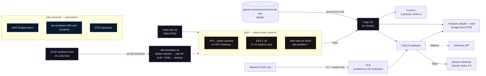

# HomeLab-aws — ephemeral EKS sandbox

An Amazon EKS cluster that is built from nothing with OpenTofu, bootstraps its
own Argo CD, serves an AI gateway through an internet-facing ALB, and is
**destroyed every night at 02:00** by a scoped, least-privilege teardown job.
A full session costs about **$1**. Left running, the same cluster would cost
about **$85 a month**.

It is the cloud counterpart to [swares/HomeLab](https://github.com/swares/HomeLab),
a 14-host on-prem GitOps platform, and is deliberately detachable from it.
Nothing here touches the lab's k3s cluster, Argo CD, Vault, or NAS. Deleting
this repo and running one teardown leaves no trace on either side.

> **Read the story:** [docs/CASE-STUDY.md](docs/CASE-STUDY.md) covers the
> design decisions, what broke, and what I'd do differently.

## What this demonstrates

| Skill | Where to look |
|---|---|
| **EKS from zero with OpenTofu.** VPC, IAM, managed node group on spot, and add-ons, with S3 remote state that stays reachable even if the home lab is down | `tofu/` |
| **Workload identity (IRSA), no static AWS keys.** Pods assume IAM roles through the cluster's OIDC provider, with trust policies pinned by `sub` and `aud`. `make irsa-check` proves the pod holds a token path and a role ARN, and no key of any kind | `tofu/litellm.tf`, `tofu/alb-controller.tf` |
| **Self-bootstrapping GitOps.** Tofu installs Argo CD, Argo installs everything else from this public repo (app-of-apps, sync waves, `selfHeal` and `prune`) | `tofu/argocd.tf`, `gitops/` |
| **Policy as code.** Kyverno in Enforce mode: no `:latest` tags, no privileged pods, resource limits required | `gitops/workloads/kyverno/` |
| **Controller-created infrastructure, cleaned up correctly.** The AWS Load Balancer Controller creates ALBs that Tofu never sees. Teardown deletes the Ingresses, waits until AWS has released the load balancers *and their ENIs*, then destroys, and it fails closed | `scripts/eks-teardown.sh` |
| **FinOps guardrails.** No NAT Gateway, spot nodes, nightly teardown on a systemd timer, an AWS Budget kept in a separate module that is never destroyed, and `upgrade_policy = STANDARD` to avoid 6× extended-support pricing | `tofu-account/`, `systemd/` |
| **Least privilege and secret hygiene.** The teardown identity can only delete what `tofu/` creates. Per-cluster secrets live and die with the cluster, and issued credentials never touch Tofu state, git, or disk. The home IP that gates the ALB stays out of this public repo | `tofu-account/teardown-user.tf`, `CLAUDE.md` |
| **Break-glass planning.** A lockout is treated as a billing event, and a printed recovery envelope starts with "stop the charges" | `docs/BREAK-GLASS.md` |

## Architecture



Red is rebuilt and destroyed every session. Blue is permanent and deliberately
outside the nightly destroy. A backstop destroyed alongside the thing it
watches is not a backstop.

## Results

| Phase | What was proven | Status |
|---|---|---|
| 0 | Create/destroy loop, self-bootstrapping Argo CD, Kyverno baseline, nightly teardown timer | Done |
| 1 | LiteLLM → Bedrock through IRSA, end to end, with no static AWS keys | Done. IRSA proven. Bedrock is blocked account-wide by AWS (support case open), so Claude is served through the direct-API fallback, verified 2026-09-23 |
| 2 | AWS Load Balancer Controller, and an ordered teardown with a **live ALB** that leaves nothing behind | Done, verified 2026-09-25 |
| 2a | LiteLLM behind the ALB: `/v1` only, per-cluster master key, source-CIDR restricted | Done, verified live 2026-09-25 |
| 2b | Edge-device adapter, built from [My_M5Stack_Core_Framework](https://github.com/swares/My_M5Stack_Core_Framework) and pulled from ECR, served behind LiteLLM | Done, verified live 2026-09-25 |
| 3 | Karpenter with GPU spot nodes, Whisper batch transcription | Not started |

Known gaps are listed honestly: the break-glass envelope isn't filled in yet
and its drill hasn't run (BACKLOG 1.4, 1.5).

---

*Everything below is the operator documentation.*

## Why it is shaped this way

- **Separate repo, not a subtree.** The two bodies of work disagree on
  lifecycle (permanent vs. 8 hours), state backend (Minio vs. S3), blast radius,
  and operating rules. Merging them would mean one rulebook with a section of
  exceptions.
- **Argo CD lives in the cluster, not in the lab.** Tofu installs it via Helm
  and it dies with the cluster. The lab's Argo never registers an AWS
  destination, so there is no rotating endpoint to write back into Vault, no
  static IAM credentials in the lab control plane, and no Applications sitting
  `Unknown` in the lab UI every night after teardown. The cost is that EKS app
  status is not visible in lab Grafana.
- **Public subnets, no NAT Gateway.** A NAT Gateway is ~$32/mo and would cost
  more than the nodes. Not a production pattern; the right call for a cluster
  that lives 8 hours. See `tofu/vpc.tf`.
- **Teardown is a script, not `tofu destroy`.** Kubernetes controllers create
  AWS resources Tofu has no record of. See `scripts/eks-teardown.sh`.
- **The repo is public and Argo reads it anonymously.** No deploy key, no
  credential shared with the lab.

## Repo map

| Path | What it is |
|---|---|
| `tofu/` | Root module: VPC, IAM, EKS, addons, Argo CD bootstrap. Destroyed nightly |
| `tofu-account/` | **Permanent** root module: the monthly budget, the teardown identity, and the adapter's ECR repository. Never torn down |
| `gitops/apps/` | App-of-apps children (Argo `Application` objects) |
| `gitops/workloads/` | Manifests the Applications point at |
| `gitops/bootstrap/` | Reference copy of the root Application (the live one is in `tofu/argocd.tf`) |
| `scripts/` | `eks-teardown.sh` (ordered teardown), `install-teardown-timer.sh` (sets up the 02:00 timer on n150-2), `print-aws-envelope.sh`, `backlog-audit.py` (vendored from the lab) |
| `systemd/` | Nightly teardown timer (runs on `n150-2`) |
| `docs/CASE-STUDY.md` | The write-up: why it's built this way, what broke, lessons |
| `docs/BREAK-GLASS.md` | AWS lockout envelope — prompted, printed, stored off-site |
| `BACKLOG.md` | Open work **outside** the roadmap: account issues, AWS requests, hygiene. `make backlog` audits it |
| `CLAUDE.md` | Operating rules — read before touching anything |

## Quickstart

```bash
# One-time: create the state bucket (see tofu/backend.tf for the commands)
cp tofu-account/terraform.tfvars.example tofu-account/terraform.tfvars  # set budget_email
make account-init && make account-apply     # permanent budget - once, not per session
cp tofu/terraform.tfvars.example tofu/terraform.tfvars
make init

make eks-up                   # ~15 min. Billing starts.
eval "$(make -s eks-env)"     # point THIS shell's kubectl at the sandbox
make argocd-ui                # password + port-forward on :8080
make eks-down                 # ordered teardown; also deletes the sandbox kubeconfig
```

The sandbox never writes to `~/.kube/config`. Its kubeconfig lives in
`~/.kube/eks-sandbox`, so a shell you didn't `eval` in still talks to whatever
it talked to before - on n150-2, that's the lab.

`make eks-status` answers "is anything billing right now?"

Before the first long session, fill `docs/BREAK-GLASS.md`. Losing access to the
lab costs data; losing access to AWS costs money continuously, with no way to
stop it.

## What runs here

| App | Namespace | Notes |
|---|---|---|
| Argo CD | `argocd` | Installed by Tofu, not by itself. Dies with the cluster. |
| Kyverno | `kyverno` | Helm chart, sync-wave -1 |
| Kyverno policies | `kyverno` | Three ClusterPolicies vendored from HomeLab, sync-wave 0 |
| LiteLLM | `litellm` | Phase 1. OpenAI-compatible gateway to Claude Haiku 4.5 on Bedrock, sync-wave 1. **No AWS keys**: the pod gets credentials through IRSA. Falls back to the Anthropic API directly while Bedrock is unavailable; that key is prompted per session by `make litellm-key` and never in git or Tofu. Phase 2a: reachable through the ALB at `/v1` only, from `alb_allowed_cidrs` only, with a per-cluster master key (`make litellm-url`) |
| AWS Load Balancer Controller | `kube-system` | Phase 2. Installed by Tofu. Turns Ingress objects into real ALBs - resources Tofu has no record of, which is why teardown is ordered |
| m5stack-adapter | `m5stack` | Phase 2b. OpenAI-compatible front for the M5Stack device protocol, built from [My_M5Stack_Core_Framework](https://github.com/swares/My_M5Stack_Core_Framework) and pulled from ECR. Reached only through LiteLLM, as models `m5` and `m5-llm`. ClusterIP |
| m5-stub | `m5stack` | Phase 2b. Stands in for the device: implements the framework's fire-and-poll protocol on a stock Python image, answers with `route_taken: stub-<slug>`. Nothing reaches the lab |

The ALB's allowed source CIDR is **not in this repo**: Tofu builds the
`lab-sandbox-alb-ingress` security group from `alb_allowed_cidrs` in the
gitignored tfvars, and the Ingress references that group by name.

Ownership is split on purpose. Argo deploys the LiteLLM workload from git.
Tofu owns its **identity**: the IAM role, the namespace, and the ServiceAccount
whose annotation holds the role ARN (`tofu/litellm.tf`). That keeps the account
ID out of this public repo, and means the role and the only thing that can use
it are created and destroyed together.

## Cost

| Item | Rate | 8-hour session |
|---|---|---|
| EKS control plane | $0.10/hr | $0.80 |
| 2× t3.medium spot | ~$0.0125/hr ea | ~$0.20 |
| gp3 volumes, 30 GB ×2 | ~$0.08/GB-mo | ~$0.05 |
| NAT Gateway | **not created** | $0.00 |
| Bedrock, Claude Haiku 4.5 | per token | cents for a session of testing |
| Anthropic API, Claude Haiku 4.5 (fallback) | per token, billed by Anthropic | cents; only when Bedrock fails. Not in the AWS Budget |
| Application Load Balancer | ~$0.023/hr + LCUs | ~$0.20 (every session since phase 2a: the LiteLLM Ingress) |
| ECR, adapter image (permanent) | $0.10/GB-month | about a cent a month; not per session |
| **Total** | | **~$1.05**, or ~$1.25 with an ALB, plus Bedrock usage |

Left running for a month, the same cluster is roughly **$85**. If the
Kubernetes version slips into extended support, the control plane alone goes
from $73/mo to about $438/mo. Both numbers are why the nightly timer exists.

## Roadmap

| Phase | Content | Status |
|---|---|---|
| 0 | Create/destroy loop, self-bootstrapping Argo, Kyverno baseline, nightly teardown timer | done, except break-glass: the envelope isn't filled in yet and Drill A hasn't run (BACKLOG 1.5, 1.4) |
| 1 | LiteLLM → Bedrock via **IRSA** (the core EKS lesson) | done - IRSA proven end to end. Bedrock itself is blocked account-wide (RUNBOOK, Error 002); Claude is served through the direct-API fallback, verified 2026-09-23 |
| 2 | ALB controller and ingress, then the m5stack-adapter behind it, self-contained (a stub receiver stands in for the device - nothing reaches the lab) | done: controller and teardown with a live ALB; **2a** LiteLLM behind the ALB with a master key, verified live 2026-09-25; **2b** adapter + stub behind LiteLLM, verified live 2026-09-25 (both routes answered through the ALB, then a clean nightly teardown) |
| 3 | Karpenter + GPU spot nodes; Whisper large-v3 batch | not started |

Lead-time items to start before phase 3: the **G-instance service quota**
(often 0 vCPUs on new accounts — a hard block, and the increase can take days)
and **Bedrock model access**, which is granted per-model per-region.

Work that is not a phase (account problems, quota requests, hygiene) is tracked
in [`BACKLOG.md`](BACKLOG.md), not here.

## Relationship to the lab

Upstream for the Kyverno policies only, and that copy is a **snapshot allowed
to drift**. The EKS sandbox is a short-lived training cluster; a stale policy
here costs nothing, and keeping two repos in lockstep is more machinery than
the problem deserves.
